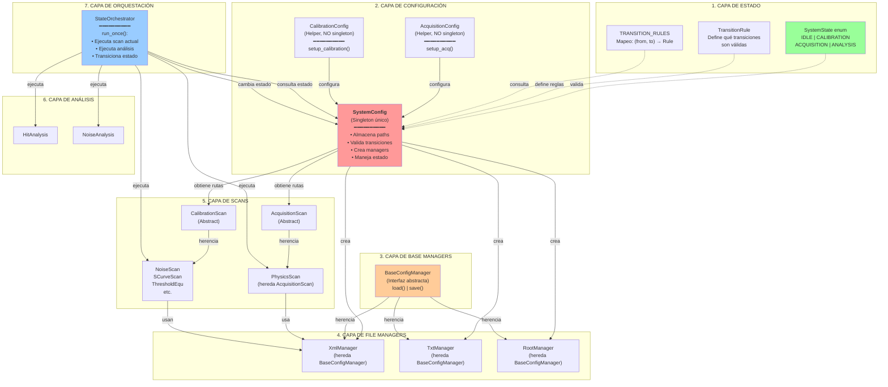

# RD53 StateMachine_architecture

## Overview

The RD53 system is organized into 7 layers:



## Layers Explained

### Layer 1: State Layer (`system_state.py`)
Defines the 4 possible states and transition rules:
- **IDLE**: System at rest, not configured
- **CALIBRATION**: Running calibration scans
- **ACQUISITION**: Running physics data acquisition
- **ANALYSIS**: Analyzing acquired data

### Layer 2: Configuration Layer
- **SystemConfig**: The only singleton instance managing all system configuration
  - Stores paths (ph2_acf_dir, xml_path, root_path, txt_base_dir)
  - Manages current state
  - Validates state transitions
  - Creates managers on demand
  
- **AcquisitionConfig**: Helper class (NOT singleton) for acquisition setup
  - Calls `setup_acq(ph2_acf_dir, xml_path)` to configure SystemConfig
  
- **CalibrationConfig**: Helper class (NOT singleton) for calibration setup
  - Calls `setup_calibration(base_dir, chip_id)` to configure SystemConfig

### Layer 3: Base Manager Interface (`base_config_manager.py`)
Abstract interface defining the contract for all file managers:
- `load()`: Load configuration from file
- `save()`: Save configuration to file
- `is_loaded()`: Check if configuration is loaded
- `is_dirty()`: Check for unsaved changes
- `get_path()`: Get file path

### Layer 4: File Managers
Concrete implementations inheriting from BaseConfigManager:
- **XmlManager**: Loads/saves XML configuration files
- **TxtManager**: Loads/saves text configuration files
- **RootManager**: Loads/saves ROOT data files

### Layer 5: Scans Layer
Base classes for different types of scans:
- **AcquisitionScan**: Abstract base for acquisition scans
  - **PhysicsScan**: Physics data acquisition implementation
  
- **CalibrationScan**: Abstract base for calibration scans
  - **NoiseScan**, **SCurveScan**, **ThresholdEqualizationScan**, etc.

### Layer 6: Analysis Layer
Post-acquisition data processing:
- **HitAnalysis**: Analyzes hit patterns
- **NoiseAnalysis**: Analyzes noise levels

### Layer 7: Orchestration Layer (`state_orchestrator.py`)
Coordinates everything:
- Executes scans based on current state
- Runs analysis on results
- Updates system metrics (noisy pixel count)
- Triggers state transitions
- Main event loop

## Typical Usage Flow

```python
# 1. Create the central singleton
sys_config = SystemConfig()
sys_config.setup()  # Register transition conditions
sys_config.set_state(SystemState.IDLE)

# 2. Configure for acquisition
acq_setup = AcquisitionConfig()
acq_setup.setup_acq(ph2_acf_path, xml_file)  # Configures SystemConfig

# 3. Transition state
sys_config.set_state(SystemState.ACQUISITION)  # Validates XML path exists

# 4. Orchestrator executes
orchestrator = StateOrchestrator()
result = orchestrator.run_once()  # PhysicsScan → Analysis → ANALYSIS state

# 5. Analyze and decide
if result.n_noisy_pixels > THRESHOLD:
    sys_config.set_state(SystemState.CALIBRATION)  # Recalibrate
else:
    sys_config.set_state(SystemState.ACQUISITION)  # Continue acquiring
```

## Key Design Principles

1. **Single Singleton**: Only `SystemConfig` is a singleton (guaranteed single instance)
2. **Separation of Concerns**: Each layer has a specific responsibility
3. **Dependency Injection**: Helpers (AcquisitionConfig, CalibrationConfig) configure the singleton
4. **State Validation**: All transitions are validated before execution
5. **Factory Pattern**: SystemConfig creates managers on demand
